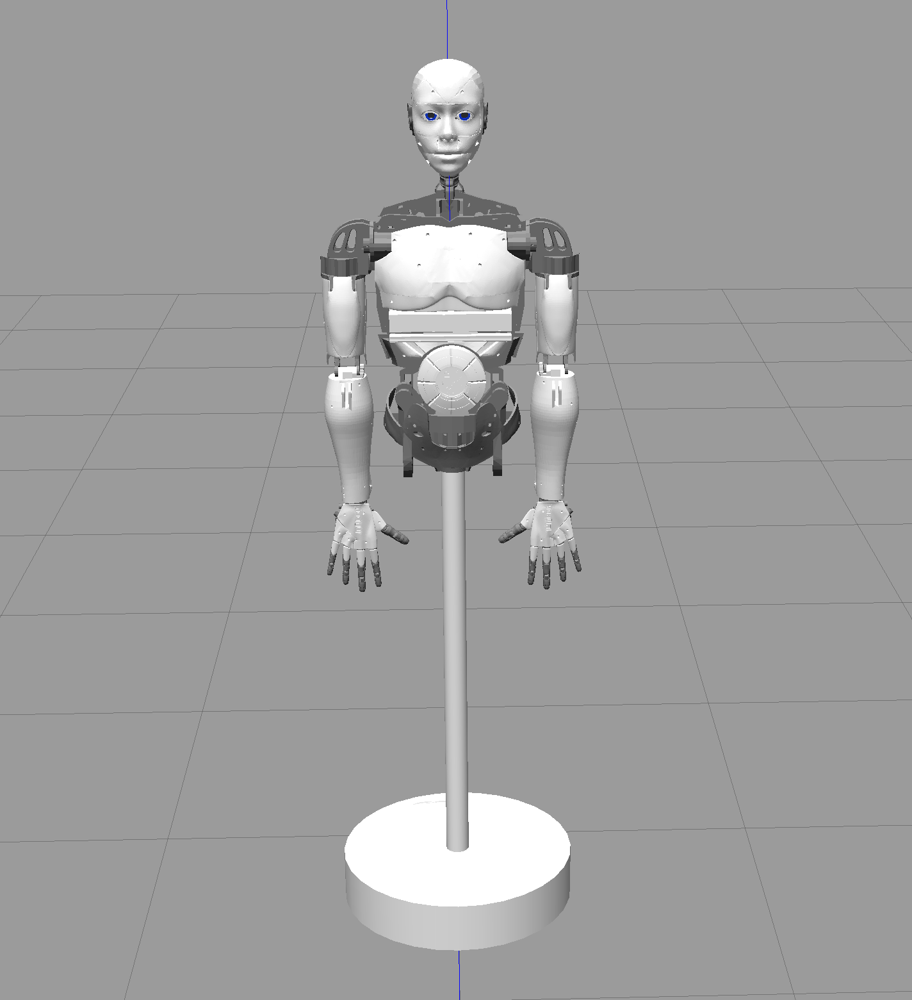

# Visualization

**Note: this has not been tested with the packages students have wrote**



## Rviz

### Fake controllers

Allows testing in a rviz without the real robot (creates fake joint state publisher):

```console
roslaunch moveit_config demo.launch
```

### Real controllers

To launch the head controller and turn the head
run following launch files:

```console
roslaunch dynamixel-test.launch
roslaunch head_controller.launch
roslaunch moveit_config real.launch
roslaunch inmoov_behaviours turn_head.launch
```

Rviz receives joint states from the dynamixel workbench node;
therefore, the robot pose should update in Rviz
to match servos.

The head controller (`JointTrajectoryAction` action server) listens
on `/head_controller/follow_joint_trajectory/` namespace and publishes to `/inmoov/joint_trajectory`.

The [ros_controllers.launch](src/moveit_config/launch/ros_controllers.launch), included by `real.launch` is responsible for publishing data
to `/head_controller/follow_joint_trajectory/` and to other
controllers when configured so.

Rviz tutorial: http://docs.ros.org/melodic/api/moveit_tutorials/html/doc/quickstart_in_rviz/quickstart_in_rviz_tutorial.html

Note that sometimes the `turn_head`
script may fail because of `Failed to fetch current robot state`
error, if the dynamixel controller has not updated joint states for some reason.

#### Gazebo (Simulation) [WIP]

**This is work in progress, physics do not seem to work correctly with the robot. rviz is probably good enough for testing most features without the real robot**

Launch empty gazebo world:

```console
roslaunch gazebo_ros empty_world.launch paused:=true use_sim_time:=false gui:=true throttled:=false recording:=false debug:=true
```

Add robot to the world:

```console
rosrun gazebo_ros spawn_model -file $WORKSPACE/src/inmoov_description/urdf/inmoov-moveit-gazebo.urdf -urdf -x 0 -y 0 -z 1 -model inmoov
```
